#Tutorial

## Thanks to [救救-99](https://www.bilibili.com/video/BV1d741147k2?share_source=copy_web) this note is inspired by her

# Title Contrast with# #

## Title ##

### Title ###

#### Title ####

##### Title #####

###### Title maximum 6 ######


## Text

### TextBlock

```markdown
``
```

` block`


###删除线——strikethrough (~)

```markdown
This is ~~strikethrough (~)
```

This is ~~strikethrough~~


### 斜体——Italic (*)

```markdown
This is *Italic* (* text *)
```

This is *Italic*


### 粗体——Bold (**)

```markdown
This is **Bold** (** text **)
```

This is  **Bold**


### 下划线——Underline (u)

Grammar in Html

下划线 <u>下划线（Command+U)</u>


### 高亮——Highlight(==)

```markdown
This is ==斜体+粗体== 的文本
```

==斜体+粗体==

==文字==


### 下标——Subscript(~text )

```markdown
氵H~2~O  (~)
```

水 H~2~O

H~2~O~2~


### 上标——Superscript(^text)

```markdown
面积 m^2^
体积 m^3^
```

Area m^2^

Volume m^3^


### 表情符号——Emoji (:emoji)

#### Some Example

```markdown
:smile
```

:sheep: :smile: :heart: 

####==Ctr== + ==Com== + ==Space==


### 表格——Table

使用 ==`|`== To separate different columns and using `-`

```markdonw
name | price ($)
--- | ---
onion | 19
chicken wings | 24 
cola | 5
```

| name          | price ($) |
| :------------ | --------- |
| onion         | 19        |
| chicken wings | 24        |
| cola          | 5         |


For clarity and alignment we ckiyd using `|` in the each ends of the table

And we can insert `:` to label the alignment

`: text` left  `:text:`middle ; and of course `text:` for right

```markdown
|name | price ($)|
| :--- | :---: | 
|onion | 19 |
|chicken wings | 24 |
|cola | 5|
```

| name          | price ($) |
| :------------ | :-------: |
| onion         |    19     |
| chicken wings |    24     |
| cola          |     5     |

使用`command + option + t` 


### 引用——Citation (>)

```markdown
>"Start up now！"
```

> "startup	now!"

```markdown
>也可以在引用中
>>使用嵌套的引用
```

> HatsuneMiku
>
> > Sekai Itiban Ohime Sama


##列表 ——List

###NOORDER——Sign & Space

```markdown
* 可以使用 `*` as mark
+ 也可以使用 `+`
- Or `-`
```

* 可以使用 `*` as mark
+ 也可以使用 `+`

- Or `-`


### Ordered——Math `.` Space

```markdown
1. 有序列表以数字和`.` 开始；
2. 数字的有序列表并不会影响生成的列表序列；
4. 但以natural order will be the best。
```

1. 有序列表以数字和`.` 开始；

2. 数字的有序列表并不会影响生成的列表序列；

3. 但以natural order will be the best。

   ```markdown
   可以使用：数字\. 来取消显示为列表（\）
   ```

   

## Code

### CodeBlock(```)

```markdown
​```语言名称
```


```java
public static void main(String[] args){
  
}
```


###行内代码

```markdown
也可以通过``, 插入行内代码
For example `java`
```

`java` 


### 转换规则

代码块中的文本（包括markdown） 都会显示为原始内用


## 分割线(*** --- ___)

用three or even more `*` ,`-`,or `_` to add seperate line:

```markdown
***
--------
___
```

***
--------
___


## 跳转

### Hyperlinks(`[link text](links)`)

```markdown
[Mikufans](https://kanelmis.github.io/Mikumikumi.io/)
```

[Mikufans](https://kanelmis.github.io/Mikumikumi.io/)


### 内部跳转——inside file

格式为 `[link text] (#destination——Title)`.

```markdown
[Text](#Text)
```

[Text](#Text)

> Open Links inTypota
>
> > we can use `Command + Click` shortcuts


### 自动链接

使用 `<>`包括的URL或邮箱地址会被自动转换为超链接

```markdown
<https://kanelmis.github.io/Mikumikumi.io/>
star@gmail.com
```

<https://kanelmis.github.io/Mikumikumi.io/>

star@gmail.com


## 图片——Images

```markdown
:[names](path)
```

### From net (``)

```markdown

```


### 本地图片——Local

```markdown

or drag to text
```


## 利用Markdown画图

markdown是轻文本编辑器

Mermaid 用于画流程图，状态图，时序图，甘特图的library，用JS进行本地rendering。 As a 里边嚷嚷要

it generates HTML codes instead of images


流程图（graph）

```markdown
graph 方向描述
	图表中的其他语句...
```

关键词graph 表示一个流程图的开始，同时需要指定方向。

“方向描述为”

| 用词 | 含义     |
| ---- | -------- |
| TB   | 从上到下 |
| BT   | 从下到上 |
| RL   | 从右到左 |
| LR   | 从左到右 |

TB and LR are mostly used

```markdown
graph TB;
	A-->B
	B-->C
	C-->A
```

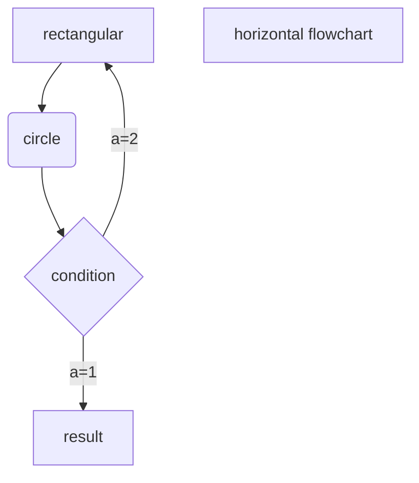


```markdown
graph TB
	begin(出门)-->buy[KFC]
	buy --> IsRemaining{"还有没有炸鸡？"}
	IsRemaining --> |有|happy[买完炸鸡开心]-->goback(回家)
	IsRemaining --> |没有|sad[Heartbrokes] -->goback
```


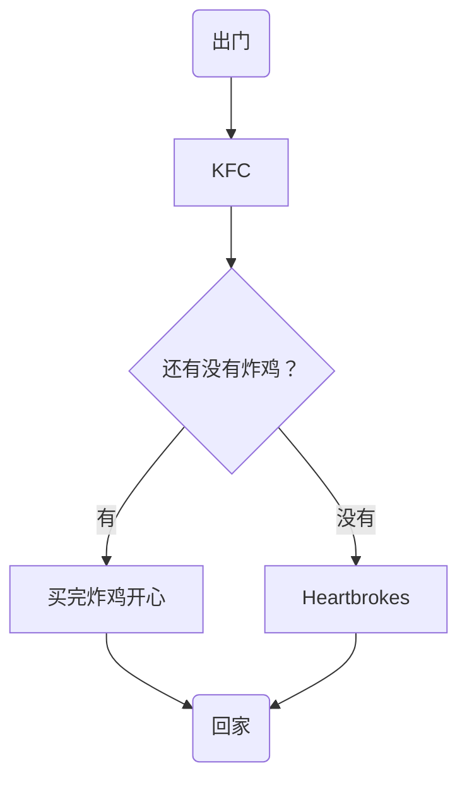


| 表述       | 说明           | 含义               |
| ---------- | -------------- | ------------------ |
| id[文字]   | 矩形节点       | 表示过程           |
| id(文字)   | 圆角矩形节点   | 表示开始和结束     |
| id((文字)) | 圆形节点       | 表示连接，避免交叉 |
| Id{文字}   | 菱形节点       | 表示判断，决策     |
| id>文字]   | 右向旗帜状节点 |                    |


### 连线

```markdown
graph TB
	A1-->B1
	A2---B2
	A3--text---B3
	A4--text-->B4
	A5-.-B5
	A6-.->B6
	A7-.text.-B7
	A8-.text.->B8
	A9===B9
	A10==>B10
	A11==text===B11
	A12==text==>B12
```


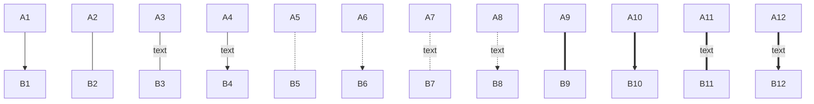

### 子图表（subgraph）

使用以下语法添加子图表

```markdown
subgraph 子图表名称
	子图表中的描述语句...
end
```

```markdown
graph TB
	subgraph 买炸鸡前
		begin(出门)-->buy[出门买炸鸡]
	end
	subgraph 买炸鸡后
		goBack==Nice===Home(Back)
	end
	buy -->IsRemaining{"还有没有炸鸡"}
	IsRemaining --没有--> sad["伤心"]--> goBack(回家)
	IsRemaining --> |宥| happy[买完炸鸡开心]--> goBack
```


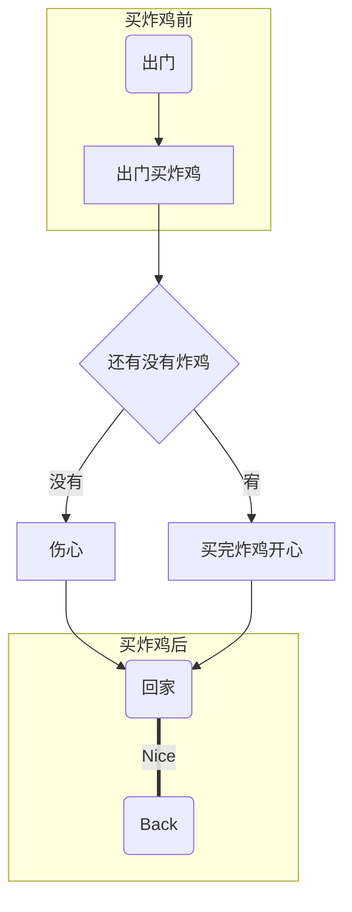

### 序列图(sequence diagram)

概述

```
sequenceDiagram
	[参与者1][消息线][参与者2]:消息体
		...
```

> `sequenceDiagram`为固定开头

```markdown
sequenceDiagram
	Title: 买炸鸡
	救救->>炸鸡店小哥: 还有炸鸡吗？
	炸鸡店小哥-->>救救: 没有，要鲜榨
```


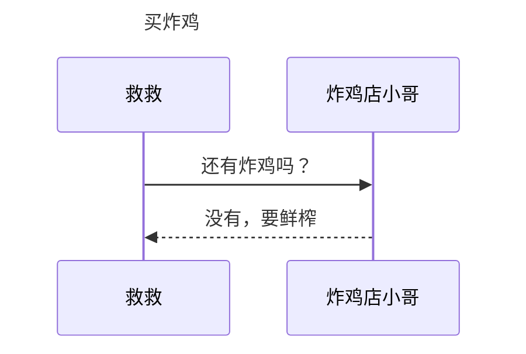

####参与者(Participant)

传统时序图概念中参与者有角色和类对象之分，但这里我们不做此区分，用参与者表示一切参与交互的事情，可以是人，类对象，系统等形式。中间竖直的线段从山歌日啊表示时间的流逝

```markdown
sequenceDiagram
	participant  参与者 1
	participant  参与者 2
	...
	participant 简称 as 参与者 3
```

> `participant <参与者名称> 声明参与者，语句次序即为参与者横向排序次序


####消息线

| 类型 | 描述                         |
| ---- | ---------------------------- |
| ->   | 无箭头的实线                 |
| -->  | 无箭头的虚线                 |
| →>   | 有箭头的实线(主动发出的消息) |
| -→>  | 有箭头的虚线(响应)           |
| -x   | 末端为X的实线 (表示异步)     |
| --x  | 末端为X的实线 (表示异步)     |


####处理中-激活框

从消息接收方的时间线上标记一小段时间，表示对消息进行处理的时间间隔

在消息线末尾增加`+`, 则消息接受者进入当前消息的“处理中”状态；

在消息线末尾增加`-`, 则消息接受者离开当前消息的“处理中”状态；

```markdown
sequenceDiagram
	participant kane as me
	participant seller as 炸鸡小哥
	me ->> seller: 还有炸鸡吗？
	seller -->> me: 没有，要现炸。
	me -x +seller:给我炸！
	seller -->> -me: 您的炸鸡好了！
```

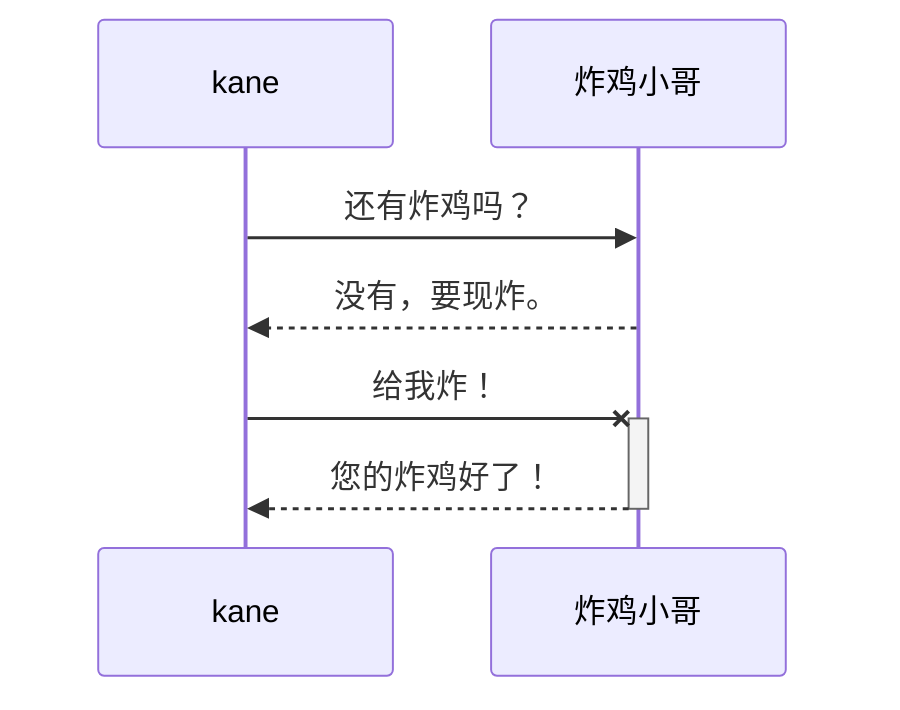

####注解 (note)

语法如下

```markdown
Note  位置表述 参与者: 标注文字
```

其中位置表述可以为

| 表述     | 含义                       |
| -------- | -------------------------- |
| right of | 右侧                       |
| left of  | 左侧                       |
| Over     | 在当中，可以横跨多个参与者 |

```markdown
SequenceDiagram
	participant me as kane
	participant seller as 小哥
	Note over me,seller : 热爱炸鸡
	Note right of me: Mikufans
	me ->> seller: 还有炸鸡吗？
	seller -->> me: 没有，要现炸。
	me -x +seller:给我炸！
	seller -->> -me: 您的炸鸡好了！
```

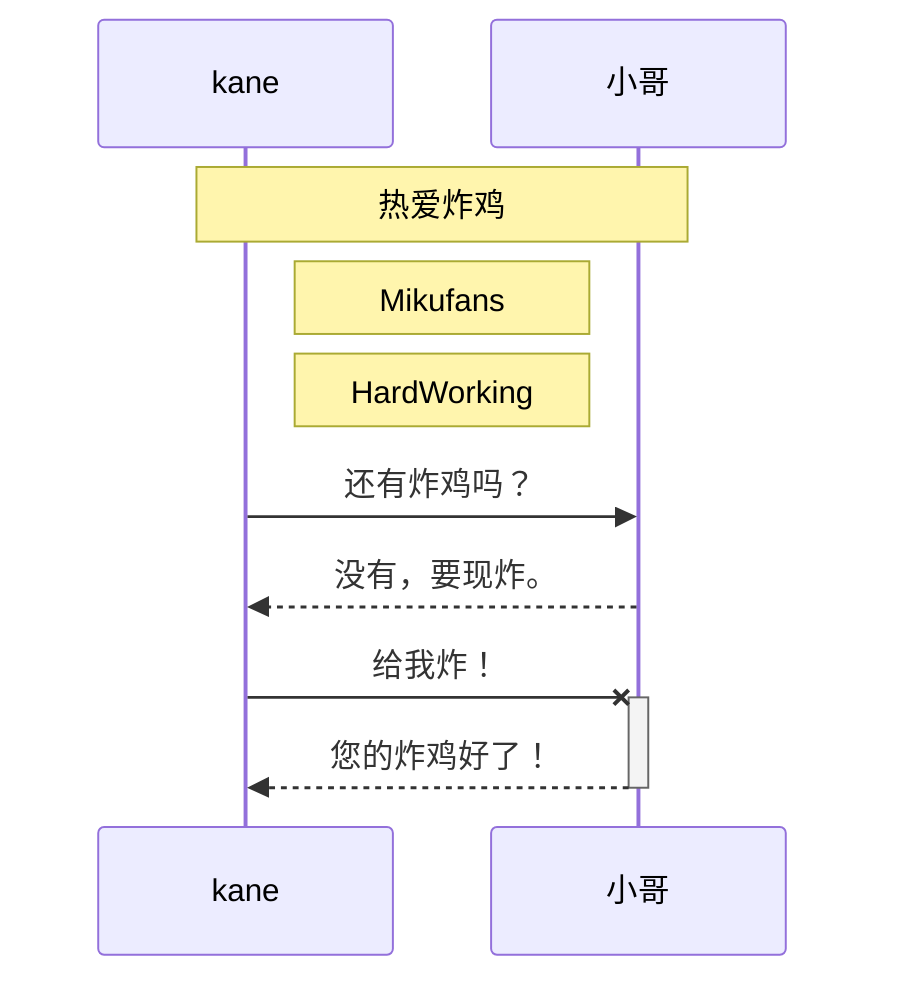

#### 循环(loop)

```markdown
sequenceDiagram
	participant me as kane
	participant seller as 小哥
	
	me ->> seller: 还有炸鸡吗？
	seller -->> me: 没有，要现炸。
	me -x +seller:给我炸！
	loop three min once
		me ->> seller :我的炸鸡炸好了么?
		seller -->> me : 在🦌上了
	end
	seller -->> -me: 您的炸鸡好了！
	
```

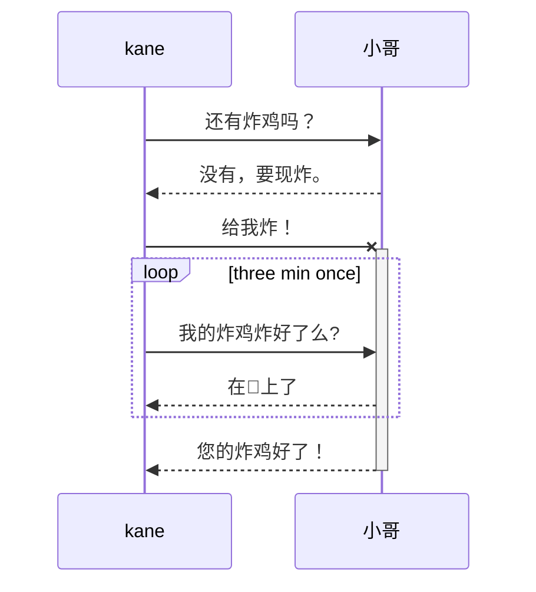

#### 可选(opt)

Equivalent to If

```markdown
sequenceDiagram
	participant me as kane
	participant seller as 小哥
	
	me ->> seller: 买炸鸡
	opt 全部卖完了
		seller -->> me : 下次再来
	end

```

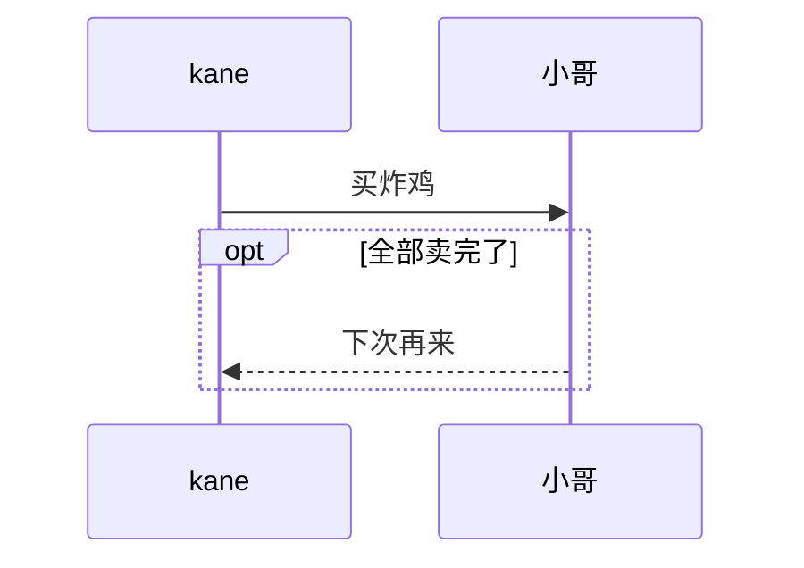

#### 并行(Par)

Execute in paralle

```markdown
sequenceDiagram
	participant me as kane
	participant seller as 小哥
	
		me ->> seller: 买炸鸡
	
		par 并行执行
			seller ->> seller : cola
		and
			seller ->> seller : chicken
		end
	
		seller -->> me : You are chicken is ready!
```

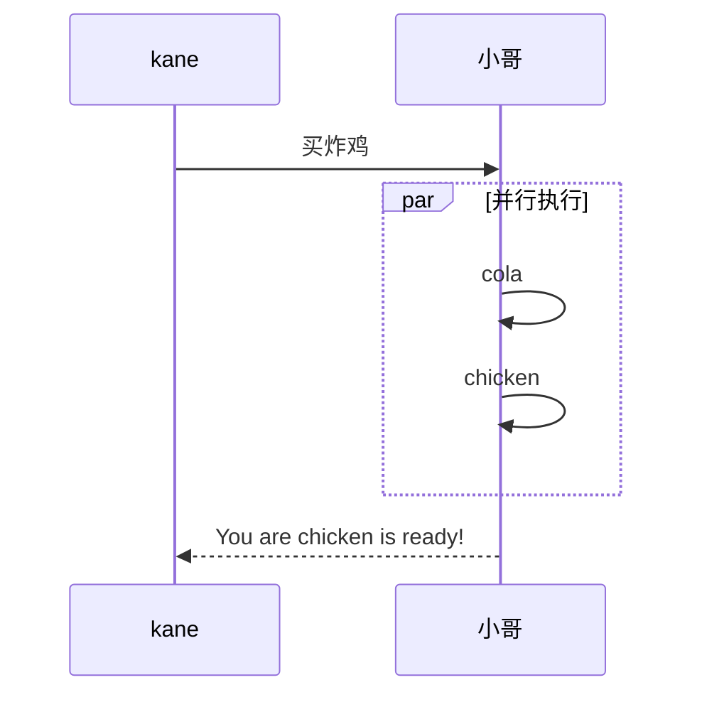

### 饼图(pie)

```markdown
Pie
	title Pie Chart
		"Heart" : 520
		"Love" : 200
		"Peach" : 0
```

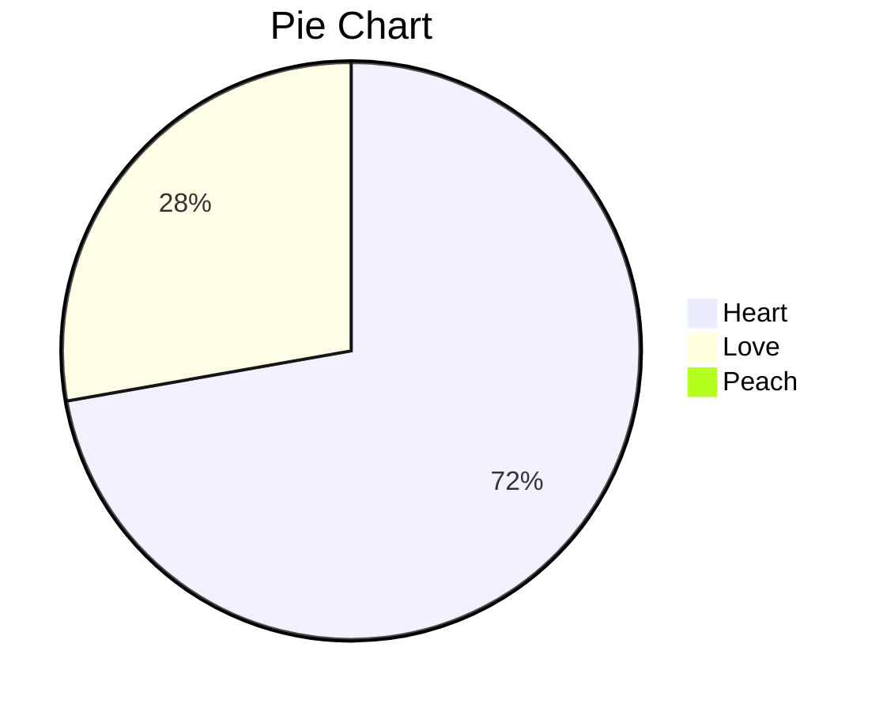

> Typora support [official links](support.typora.io/Draw-Diagrams-With-Markdown/)


### 甘特图(gantt)

```markdown
title
deteformate
section
tasks: 参数一，参数二，参数三，参数四，参数5

//参数一：crit(whether important or not, red border)
//参数二：done or active or waitlists
//参数三：nickname
//参数四：start time
//参数五：end time
```

> [Official tutorial](mermaid-js.github.io/mermaid/#/gantt)

#### Syntax

```markdown
gantt
    dateFormat  YYYY-MM-DD
    title       Adding GANTT diagram functionality to mermaid
    excludes    weekends
    %% (`excludes` accepts specific dates in YYYY-MM-DD format, days of the week ("sunday") or "weekends", but not the word "weekdays".)

    section A section
    Completed task            :done,    des1, 2014-01-06,2014-01-08
    Active task               :active,  des2, 2014-01-09, 3d
    Future task               :         des3, after des2, 5d
    Future task2              :         des4, after des3, 5d

    section Critical tasks
    Completed task in the critical line :crit, done, 2014-01-06,24h
    Implement parser and jison          :crit, done, after des1, 2d
    Create tests for parser             :crit, active, 3d
    Future task in critical line        :crit, 5d
    Create tests for renderer           :2d
    Add to mermaid                      :1d

    section Documentation
    Describe gantt syntax               :active, a1, after des1, 3d
    Add gantt diagram to demo page      :after a1  , 20h
    Add another diagram to demo page    :doc1, after a1  , 48h

    section Last section
    Describe gantt syntax               :after doc1, 3d
    Add gantt diagram to demo page      :20h
    Add another diagram to demo page    :48h
```

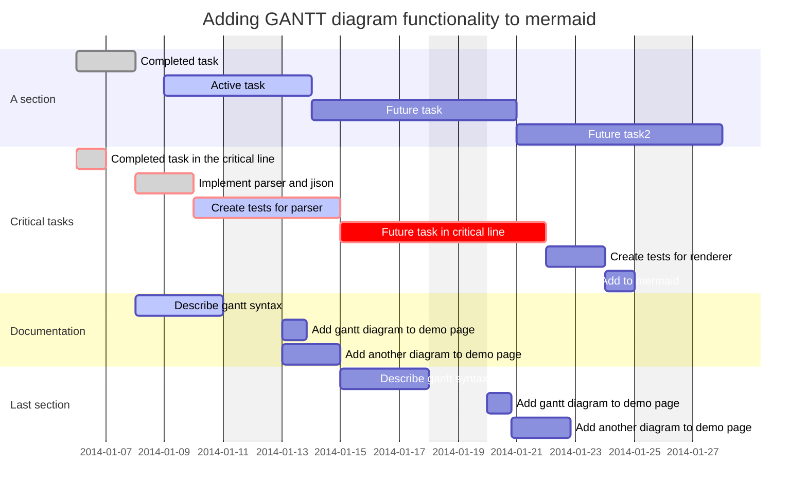

It is possible to set multiple dependencies separated by space:

```markdown
gantt
        apple :a, 2017-07-20, 1w
        banana :crit, b, 2017-07-23, 1d
        cherry :active, c, after b a, 1d


```


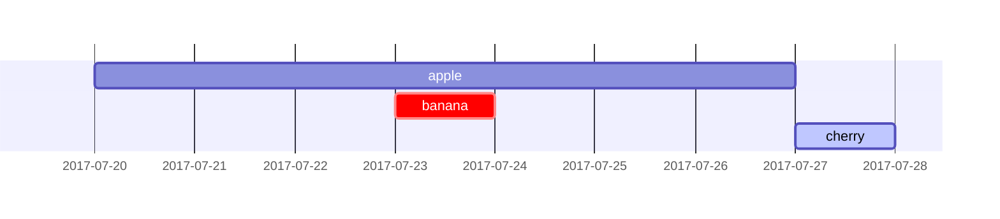


#### Setting dates

#####Input

```markdown
Input       Example             Description:
YYYY        2014                4 digit year
YY          14                  2 digit year
Q           1..4                Quarter of year. Sets month to first month in quarter.
M MM        1..12               Month number
MMM MMMM    January..Dec        Month name in locale set by moment.locale()
D DD        1..31               Day of month
Do          1st..31st           Day of month with ordinal
DDD DDDD    1..365              Day of year
X           1410715640.579      Unix timestamp
x           1410715640579       Unix ms timestamp
H HH        0..23               24 hour time
h hh        1..12               12 hour time used with a A.
a A         am pm               Post or ante meridiem
m mm        0..59               Minutes
s ss        0..59               Seconds
S           0..9                Tenths of a second
SS          0..99               Hundreds of a second
SSS         0..999              Thousandths of a second
Z ZZ        +12:00              Offset from UTC as +-HH:mm, +-HHmm, or Z
```

##### Output

The default output date format is YYYY-MM-DD. You can define your custom `axisFormat`, like `2020-Q1` for the first quarter of the year 2020.

```markdown
axisFormat  %Y-%m-%d
```

The following formating strings are supported:

```markdown
%a - abbreviated weekday name.
%A - full weekday name.
%b - abbreviated month name.
%B - full month name.
%c - date and time, as "%a %b %e %H:%M:%S %Y".
%d - zero-padded day of the month as a decimal number [01,31].
%e - space-padded day of the month as a decimal number [ 1,31]; equivalent to %_d.
%H - hour (24-hour clock) as a decimal number [00,23].
%I - hour (12-hour clock) as a decimal number [01,12].
%j - day of the year as a decimal number [001,366].
%m - month as a decimal number [01,12].
%M - minute as a decimal number [00,59].
%L - milliseconds as a decimal number [000, 999].
%p - either AM or PM.
%S - second as a decimal number [00,61].
%U - week number of the year (Sunday as the first day of the week) as a decimal number [00,53].
%w - weekday as a decimal number [0(Sunday),6].
%W - week number of the year (Monday as the first day of the week) as a decimal number [00,53].
%x - date, as "%m/%d/%Y".
%X - time, as "%H:%M:%S".
%y - year without century as a decimal number [00,99].
%Y - year with century as a decimal number.
%Z - time zone offset, such as "-0700".
%% - a literal "%" character.
```


#### Comments

Comments can be entered within a gantt chart, which will be ignored by the parser. Comments need to be on their own line and must be prefaced with `%%` (double percent signs). Any text after the start of the comment to the next newline will be treated as a comment, including any diagram syntax

```markdown
gantt
    title A Gantt Diagram
    %% this is a comment
    dateFormat  YYYY-MM-DD
    section Section
    A task           :a1, 2014-01-01, 30d
    Another task     :after a1  , 20d
    section Another
    Task in sec      :2014-01-12  , 12d
    another task      : 24d

```

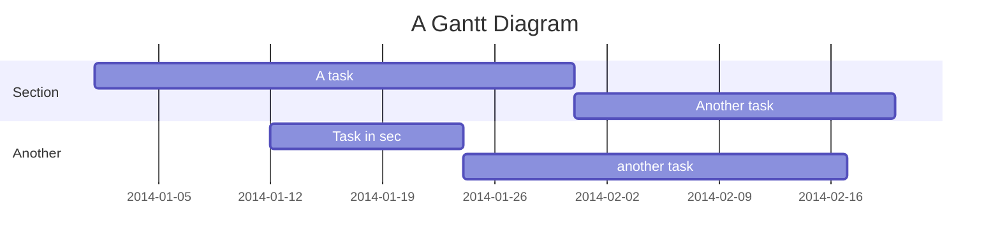

####[Styling](https://mermaid-js.github.io/mermaid/#/gantt?id=styling)

Styling of the a gantt diagram is done by defining a number of css classes. During rendering, these classes are extracted from the file located at src/themes/gantt.scss

####[Classes used](https://mermaid-js.github.io/mermaid/#/gantt?id=classes-used)

| Class                 | Description                                                  |
| --------------------- | ------------------------------------------------------------ |
| grid.tick             | Styling for the Grid Lines                                   |
| grid.path             | Styling for the Grid's borders                               |
| .taskText             | Task Text Styling                                            |
| .taskTextOutsideRight | Styling for Task Text that exceeds the activity bar towards the right. |
| .taskTextOutsideLeft  | Styling for Task Text that exceeds the activity bar, towards the left. |
| todayMarker           | Toggle and Styling for the "Today Marker"                    |


####[Sample stylesheet](https://mermaid-js.github.io/mermaid/#/gantt?id=sample-stylesheet)

```css
.grid .tick {
    stroke: lightgrey;
    opacity: 0.3;
    shape-rendering: crispEdges;
}
.grid path {
    stroke-width: 0;
}

#tag {
    color: white;
    background: #FA283D;
    width: 150px;
    position: absolute;
    display: none;
    padding:3px 6px;
    margin-left: -80px;
    font-size: 11px;
}

#tag:before {
    border: solid transparent;
    content: ' ';
    height: 0;
    left: 50%;
    margin-left: -5px;
    position: absolute;
    width: 0;
    border-width: 10px;
    border-bottom-color: #FA283D;
    top: -20px;
}
.taskText {
    fill:white;
    text-anchor:middle;
}
.taskTextOutsideRight {
    fill:black;
    text-anchor:start;
}
.taskTextOutsideLeft {
    fill:black;
    text-anchor:end;
}
```


####[Today marker](https://mermaid-js.github.io/mermaid/#/gantt?id=today-marker)

You can style or hide the marker for the current date. To style it, add a value for the `todayMarker` key.

```
todayMarker stroke-width:5px,stroke:#0f0,opacity:0.5
```

To hide the marker, set `todayMarker` to `off`.

```
todayMarker off
```


####[Configuration](https://mermaid-js.github.io/mermaid/#/gantt?id=configuration)

It is possible to adjust the margins for rendering the gantt diagram.

This is done by defining the `ganttConfig` part of the configuration object. How to use the CLI is described in the [mermaidCLI](https://mermaid-js.github.io/mermaid/#/mermaidCLI.html) page.

mermaid.ganttConfig can be set to a JSON string with config parameters or the corresponding object.

```javascript
mermaid.ganttConfig = {
    titleTopMargin:25,
    barHeight:20,
    barGap:4,
    topPadding:75,
    sidePadding:75
}
```


####[Possible configuration params:](https://mermaid-js.github.io/mermaid/#/gantt?id=possible-configuration-params)

| Param           | Description                                                  | Default value |
| --------------- | ------------------------------------------------------------ | ------------- |
| mirrorActor     | Turns on/off the rendering of actors below the diagram as well as above it | false         |
| bottomMarginAdj | Adjusts how far down the graph ended. Wide borders styles with css could generate unwanted clipping which is why this config param exists. | 1             |


####[Interaction](https://mermaid-js.github.io/mermaid/#/gantt?id=interaction)

It is possible to bind a click event to a task. The click can lead to either a javascript callback or to a link which will be opened in the current browser tab. **Note**: This functionality is disabled when using `securityLevel='strict'` and enabled when using `securityLevel='loose'`.

```
click taskId call callback(arguments)
click taskId href URL
```

- taskId is the id of the task
- callback is the name of a javascript function defined on the page displaying the graph, the function will be called with the taskId as the parameter if no other arguments are specified.

Beginners tip, a full example using interactive links in an html context:

```html
<body>
  <div class="mermaid">
    gantt
      dateFormat  YYYY-MM-DD

      section Clickable
      Visit mermaidjs           :active, cl1, 2014-01-07, 3d
      Print arguments         :cl2, after cl1, 3d
      Print task              :cl3, after cl2, 3d

      click cl1 href "https://mermaidjs.github.io/"
      click cl2 call printArguments("test1", "test2", test3)
      click cl3 call printTask()
  </div>

  <script>
    var printArguments = function(arg1, arg2, arg3) {
      alert('printArguments called with arguments: ' + arg1 + ', ' + arg2 + ', ' + arg3);
    }
    var printTask = function(taskId) {
      alert('taskId: ' + taskId);
    }
    var config = {
      startOnLoad:true,
      securityLevel:'loose',
    };
    mermaid.initialize(config);
  </script>
</body>
```


### 修改CSS

This is a paragraph

# Changing head size

> Making grey area to blue

